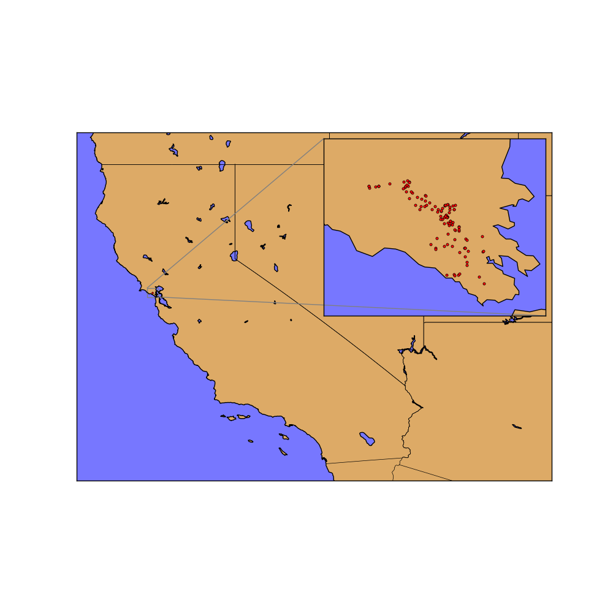

##Stravaboards

A natural extension of Strava’s gameful approach to exercise tracking. An intra-segment leaderboard, with objective athlete ratings derived from all efforts on each personally attempted segment.

###Motivation

The recent gamification of difficult endeavors to serve as motivation to progress ones' skills has changed the way society looks at challenges. Strava provides a pace based exercise tracking service that allows users to compare their efforts to other users who have tried the same segment thereby instilling a gameful mindset in their user who naturally want to be at the top of the leaderboards.

However, currently, Strava does not provide it's users with a way to compare themselves across segments. To motivate why this is a difficult question to answer consider how you would objectively compare two athletes who aren't participating in the same workouts?

###Overview

After collecting all historical effort data from Strava's API for a set of 109 segments to the north of San Fransisco (see figure below), chosen for their likelihood of not being commuter routes, and loading it all into a Mongo database the data was exported to JSON and moved to an AWS instance. On the remote machine it was possible to analyze the data with pandas on Amazon's powerful hardware.

The back-end of the of the model is a low-rank approximation non-negative matrix factorization (NMF). The selection of this model was given a great deal of thought. Returning to the motivating question: how you would objectively compare two athletes who aren't participating in the same workouts? A simple and extraordinarily naive proxy for skill could be speed in which a segment is completed. However, this interpretation of "skill" neglects the difference in difficulty that inherently lies between segments. Intuitively, one would want to attribute more skill to athletes that complete more difficult segments and complete the faster.

This is the beauty of matrix factorization methods. They inherently pick up on the interaction between the athletes and the segments; learning how skillful athletes are, regardless of segment, while simultaneously discovering a notion of segment difficulty. The synergistic manner in which the NMF model discovered these two ideas is what makes it so powerful.

###Data

One thing that should certainly be brought up is the sparsity of the data set. For each segment each of the historical efforts for each athlete was collected. And while the data for each of these efforts was dense; by no means did every athlete in the database ride on every segment. It was the sparsity in this dimension that presented great opportunity for this project.

In exploring different options for how to best decompose my data, e.g. exploring other factorization methods and deciding what magnitude of rank to choose for the decomposition, it was decided that the best set up for factorization was to also run the model on only up and down hill segments as to differentiate between downhill and uphill athletes. 

###Validation

Matrix factorization techniques are, at their heart, unsupervised. This means that some of the straightforward validation techniques that are available for supervised techniques (mean squared error, accuracy, etc.) have no meaning in this domain.

In order to achieve some notion of validation on an NMF model one one can leverage the fact that the act of matrix factorization allows for reconstruction of the original data, in a dense manner, as opposed to the sparse format that was fed into the model. Thus, the, so called, reconstituted
matrix, formed by multiplying the low-rank matrices for the segments and athletes together can be compared to the original data matrix.

###Hurdles

One of cruxes of this problem was intelligently removing outlying efforts, not because they belonged to abnormally fast or slow athletes, but because the GPS data was analyzed by Strava incorrectly and therefore rendered useless. Therefore, I had to be careful in designing an method to algorithmically remove "bad" outliers, caused by poor data collection or processing, while making sure that "good" outliers, which should correctly be attributed to athlete performance remained untouched.
